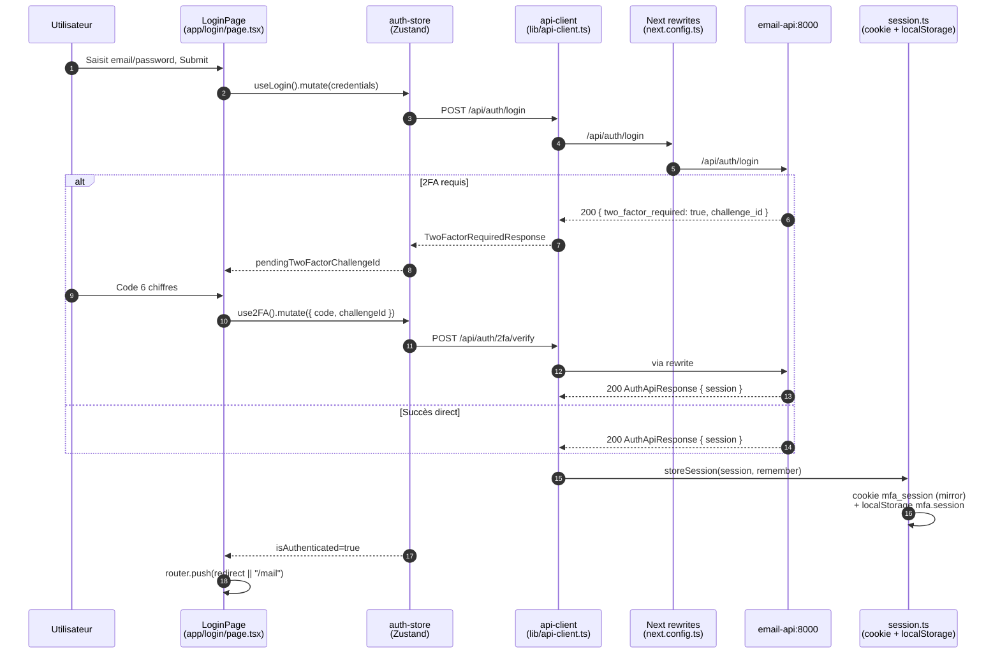
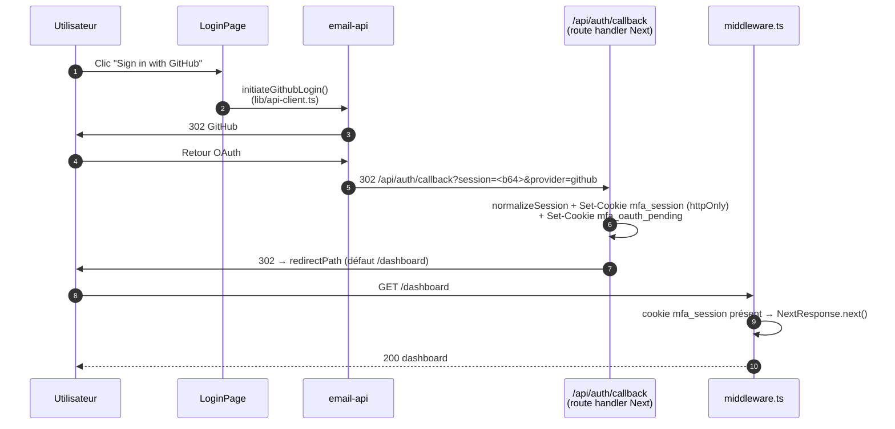
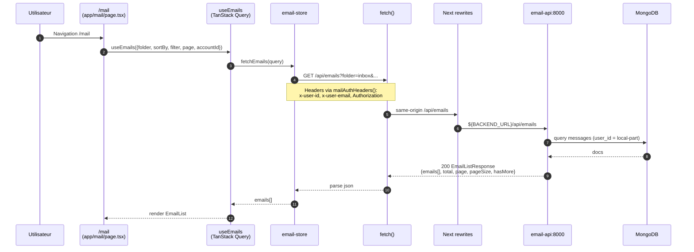
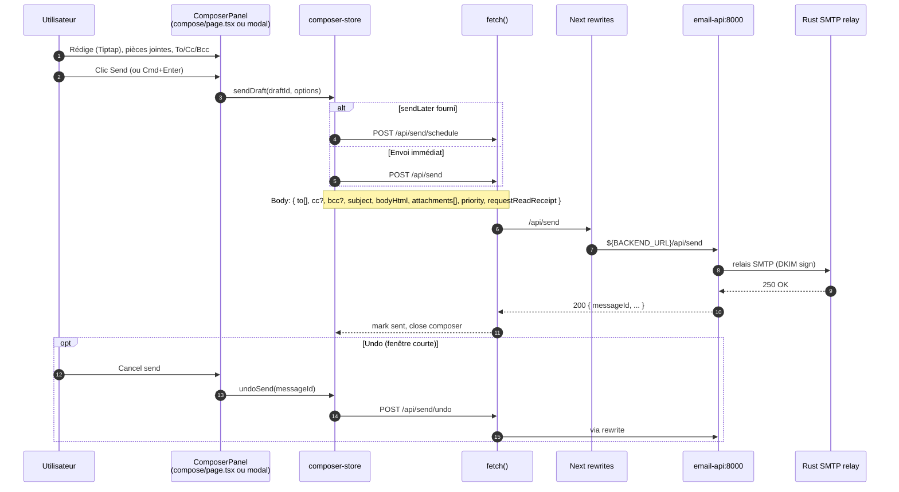
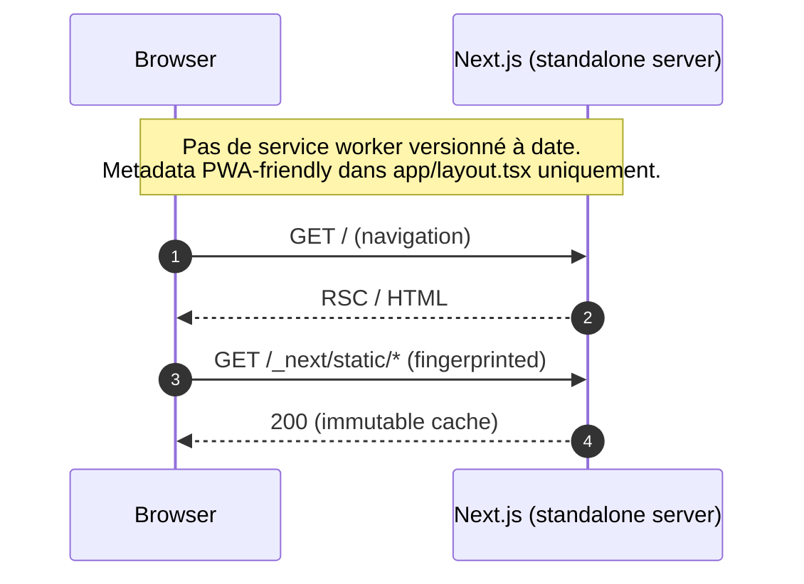
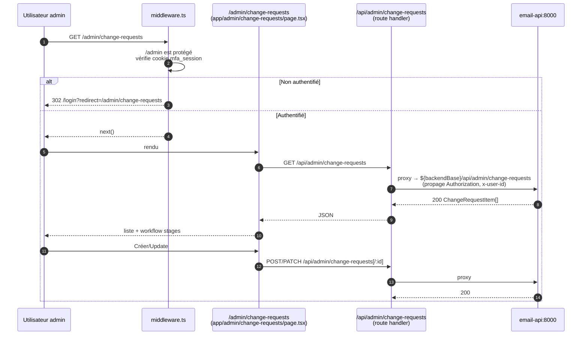
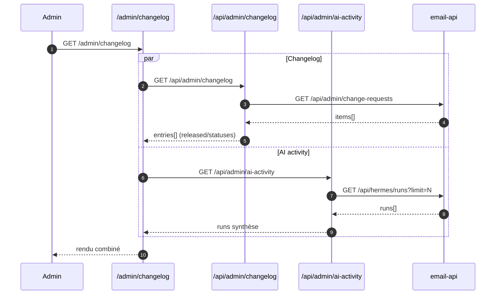

# SEQUENCE-DIAGRAMS — misfits-web

Diagrammes Mermaid ancrés sur les fichiers du repo. Chaque sequence référence le code réel.

## (a) Auth / session utilisateur

Sources: `src/app/login/page.tsx`, `src/hooks/use-auth.ts`, `src/stores/auth-store.ts`, `src/lib/api-client.ts`, `src/lib/session.ts`, `src/app/api/auth/callback/route.ts`, `src/middleware.ts`.

### Login email + password (+ 2FA optionnel)

### Login OAuth GitHub (callback)

## (b) Chargement inbox

Sources: `src/app/mail/page.tsx`, `src/hooks/use-emails.ts`, `src/stores/email-store.ts`, `src/lib/mail-api.ts`, `next.config.ts`.

## (c) Envoi d'un email via Compose

Sources: `src/app/compose/page.tsx`, `src/app/mail/page.tsx` (Modal), `src/stores/composer-store.ts`, `src/hooks/use-composer.ts`.

## (d) Rafraîchissement PWA / service worker

Constat: aucun service worker n'est enregistré dans le repo à date (voir `public/` = `favicon.svg` uniquement; aucune référence `serviceWorker`/`workbox` dans `src`). Le refresh applicatif effectif est celui de Next lui-même (rechargement standard). Diagramme reflète l'état réel:

À implémenter: `public/manifest.json`, script d'enregistrement SW, stratégies de cache. À suivre dans un ticket séparé.

## (e) Espace Admin

Sources: `src/app/admin/*`, `src/app/api/admin/*/route.ts`, `src/lib/admin-ops-api.ts`, `src/app/api/admin/ai-activity/route.ts`.

### Change-requests (workflow deliverability)

### Changelog / AI activity (agrégation lecture seule)

